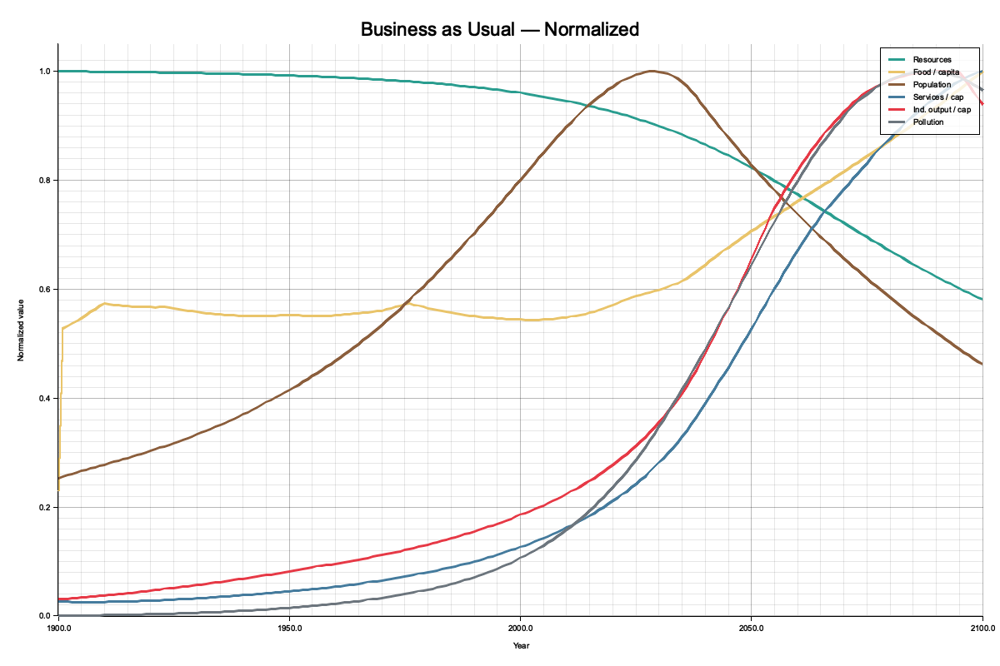

# macroco

Online live macroeconomic model based on the World 3 system dynamics model (Meadows et al., *Limits to Growth*). Extended with modern indicators: climate, energy mix, biodiversity, inequality.

**Status: Phase 5 of 6 complete** — core simulation engine, CLI, HTTP + WebSocket API, SvelteKit + D3 frontend

## Prerequisites

- Rust 1.75+
- cargo
- Node.js 18+ and npm (for frontend)

## Build

```bash
cargo build --workspace
```

## CLI Usage

All commands use the `world3-cli` binary:

```bash
cargo run --bin world3-cli -- <SUBCOMMAND> [OPTIONS]
```

### `simulate`

Run a simulation and output results.

```bash
cargo run --bin world3-cli -- simulate [OPTIONS]
```

| Flag | Default | Description |
|------|---------|-------------|
| `--preset <NAME>` | `bau` | Scenario preset: `bau`, `technology`, `stabilized` |
| `--output <FILE>` | _(none)_ | Write results to CSV file; prints summary table to stdout if omitted |
| `--start <YEAR>` | `1900` | Simulation start year |
| `--end <YEAR>` | `2100` | Simulation end year |
| `--dt <YEARS>` | `1.0` | Time step in years |
| `--chart <FILE>` | _(none)_ | Render a normalized PNG chart of all key variables |

**Examples:**

```bash
# Print summary table to stdout (BAU, 1900–2100)
cargo run --bin world3-cli -- simulate

# Write full CSV output
cargo run --bin world3-cli -- simulate --preset bau --output output.csv

# Custom time range and step
cargo run --bin world3-cli -- simulate --preset stabilized --start 1970 --end 2100 --dt 0.5

# Generate a normalized PNG chart
cargo run --bin world3-cli -- simulate --preset bau --chart bau_chart.png
```

**CSV output columns (22 fields):**

```
year, population, cohort_0_14, cohort_15_44, cohort_45_64, cohort_65_plus,
birth_rate, death_rate, life_expectancy, fertility_rate,
industrial_capital, service_capital, industrial_output, industrial_output_per_capita, service_output_per_capita,
arable_land, food, food_per_capita, land_yield,
nnr_fraction, persistent_pollution, pollution_index
```

### `validate`

Validate the BAU run against Meadows 1972 reference checkpoints. Checks qualitative dynamics (not exact values):

- 1900 population ~1.6B
- 1970 population ~3.6B
- Population peaks at 6B–12B between 2000–2070
- NNR fraction remaining in 2100 < 0.7
- Pollution index rises above 0.5 at some point

```bash
cargo run --bin world3-cli -- validate
```

### `presets`

List all available presets:

```bash
cargo run --bin world3-cli -- presets
```

## Available Presets

| Name | Description |
|------|-------------|
| `bau` | **Business as Usual** — Original World 3 standard run. No policy interventions. Reproduces Meadows et al. 1972 Fig. 35 dynamics. |
| `technology` | **Comprehensive Technology** — Resource efficiency 4×, strong pollution control (80%), improved agriculture, 75% family planning efficacy from 2000. No social or behavioral changes. |
| `stabilized` | **Stabilized World** — Full combination of technology, pollution control, family planning (95% from 1975), land protection, and resource efficiency. Closest to a sustainable trajectory in Meadows et al. |

## API Server

### Starting the server

```bash
RUST_LOG=info cargo run --bin world3-api
# Listens on 0.0.0.0:8080 by default
```

### Environment variables

| Variable | Default | Description |
|----------|---------|-------------|
| `PORT` | `8080` | TCP port |
| `RUST_LOG` | `info` | Log level (e.g. `debug`, `info,world3_api=debug`) |

### REST endpoints

All endpoints are under `/api/v1`:

| Method | Path | Description |
|--------|------|-------------|
| GET | `/health` | Health check — `{"status":"ok","version":"0.1.0"}` |
| GET | `/params/schema` | Parameter descriptors for all scenario sliders |
| GET | `/presets` | List the 3 built-in preset scenarios |
| GET | `/scenarios` | List all scenarios (presets + user-created) |
| POST | `/scenarios` | Create a new scenario from a `ScenarioParams` body |
| GET | `/scenarios/:id` | Get a scenario with its last simulation output |
| PUT | `/scenarios/:id/params` | Replace a scenario's parameters |
| DELETE | `/scenarios/:id` | Delete a scenario (403 if preset) |
| POST | `/scenarios/:id/run` | Run a simulation; returns full `SimulationOutput` |
| GET | `/ws` | WebSocket endpoint (upgrade) |

> **Note:** Preset IDs are generated at server startup (time-based hash) and change on each restart. Always call `/api/v1/presets` to discover current IDs — never hardcode them.

### curl examples

```bash
# Health check
curl http://localhost:8080/api/v1/health

# Get preset IDs
curl http://localhost:8080/api/v1/presets

# Run a preset simulation (replace <ID> with ID from /presets)
curl -s -X POST http://localhost:8080/api/v1/scenarios/<ID>/run | jq '.states | length'

# Create a custom scenario
curl -s -X POST http://localhost:8080/api/v1/scenarios \
  -H 'Content-Type: application/json' \
  -d '{"name":"My scenario","params":{"resource_technology_factor":2.0}}' | jq .

# Delete a custom scenario (returns 403 for presets)
curl -s -X DELETE http://localhost:8080/api/v1/scenarios/<ID>
```

### WebSocket usage

Connect to `ws://localhost:8080/api/v1/ws`, then drive the simulation with JSON messages.

**Flow:** connect → discover preset IDs via REST → send `start_simulation` → receive `sim_step` × 201 → receive `sim_complete`.

**Client → server messages:**

| `"type"` | Extra fields | Description |
|----------|-------------|-------------|
| `start_simulation` | `scenario_id`, optional `params` | Start (or restart) a simulation |
| `update_params` | `scenario_id`, `params` | Debounced 50 ms restart with new parameters |
| `stop_simulation` | _(none)_ | Halt current simulation |

**Server → client messages:**

| `"type"` | Extra fields | Description |
|----------|-------------|-------------|
| `sim_step` | `year`, `state` | One message per time step (1900–2100) |
| `sim_complete` | `scenario_id`, `total_steps` | Emitted after the final step |
| `sim_error` | `message` | Emitted on solver failure |
| `params_ack` | `scenario_id` | Immediate acknowledgement of `update_params` |

**wscat example:**

```bash
npx wscat -c ws://localhost:8080/api/v1/ws
# then paste (replace <ID> with a real preset ID):
{"type":"start_simulation","scenario_id":"<ID>"}
```

### SimulationOutput shape

```json
{
  "scenario_id": "uuid",
  "scenario_name": "Business as Usual",
  "timeline": [1900, 1901, ..., 2100],
  "states": [
    {
      "year": 1900,
      "population": { "total": 1.6e9, "cohort_0_14": ..., "cohort_15_44": ..., "cohort_45_64": ..., "cohort_65_plus": ... },
      "capital":     { "industrial_capital": ..., "service_capital": ..., "industrial_output": ..., "service_output_per_capita": ... },
      "agriculture": { "arable_land": ..., "food": ..., "food_per_capita": ..., "land_yield": ... },
      "resources":   { "nnr_fraction": ... },
      "pollution":   { "persistent_pollution": ..., "pollution_index": ... }
    },
    ...
  ],
  "params": { ... },
  "computed_at": "2026-02-24T12:00:00Z"
}
```

## Frontend

The SvelteKit + D3 frontend provides an interactive UI with 6 synchronized D3 charts (population, capital, agriculture, resources, pollution, combined overview), parameter sliders for all scenario knobs, scenario comparison, and live WebSocket streaming of simulation steps.

### Setup

```bash
cd frontend
npm install
```

### Environment

Create `frontend/.env` (or set environment variables):

| Variable | Default | Description |
|----------|---------|-------------|
| `PUBLIC_API_BASE` | `http://localhost:8080/api/v1` | Backend REST base URL |
| `PUBLIC_WS_BASE` | `ws://localhost:8080/api/v1/ws` | Backend WebSocket URL |

### Development server

```bash
cd frontend
npm run dev
# Opens at http://localhost:5173
```

### Type-checking

```bash
cd frontend
npm run check
```

## Documentation

See [`docs/`](docs/) for detailed feature documentation:

- [Simulation Engine](docs/simulation-engine.md) — World 3 model, sectors, solver
- [CLI Reference](docs/cli.md) — Commands, flags, output formats
- [API Server](docs/api-server.md) — REST endpoints, WebSocket streaming
- [Chart Output](docs/chart-output.md) — PNG chart rendering



## Architecture Overview

```
crates/
  world3-core/        [IMPLEMENTED] Pure simulation engine. WorldState, ScenarioParams,
                      5 sector ODEs (population, capital, agriculture, resources, pollution),
                      RK4 solver, lookup tables.
  world3-cli/         [IMPLEMENTED] Batch simulation and validation CLI.
  world3-api/         [IMPLEMENTED] Axum HTTP + WebSocket server. REST endpoints for
                      scenario CRUD, synchronous simulation runs, and streaming WebSocket
                      simulation with debounced parameter updates.
  world3-ingestion/   [PLANNED] Live data pipeline — World Bank, NOAA, FAO, UN, BP (Phase 4).
frontend/             [IMPLEMENTED] SvelteKit + D3 frontend. 6 interactive charts,
                      parameter sliders, scenario comparison, WebSocket live updates.
data/
  lookup_tables/      World 3 piecewise-linear tables (JSON). Required at runtime.
  presets/            Named scenario parameter sets (BAU, Technology, Stabilized).
docs/
  simulation-engine.md World 3 model architecture, sectors, solver
  cli.md               CLI commands and flags reference
  api-server.md        REST + WebSocket API documentation
  chart-output.md      PNG chart rendering feature
  examples/            Generated example charts
```

## Development Phases

- [x] **Phase 1** — Core simulation engine: `world3-core`, `world3-cli`, 5 original World 3 sectors, RK4 solver, validation
- [ ] **Phase 2** — Modern extensions + calibration: 4 extension sectors (climate, energy, biodiversity, inequality), historical CSV calibration
- [x] **Phase 3** — API server: Axum REST + WebSocket, streaming simulation
- [ ] **Phase 4** — Live data ingestion: 7 data sources, SQLite cache, broadcast
- [x] **Phase 5** — Frontend: SvelteKit + D3, stores, parameter sliders, scenario comparison
- [ ] **Phase 6** — Polish + deployment: benchmarks, sensitivity analysis, Docker Compose, CI

## License

GPL v3 — see [LICENSE](LICENSE).
