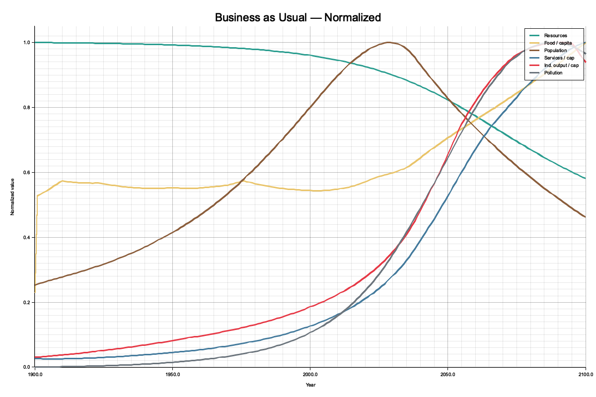

# Quick Start Guide

Get Macroco running locally in 5 minutes. No prior experience required.

## What you'll get

An interactive simulation of the World 3 model from *Limits to Growth* (1972). You'll see six charts tracking population, resources, food, industrial output, pollution, and life expectancy from 1900 to 2100. You can change assumptions with sliders and compare different scenarios side by side.



---

## 1. Install prerequisites

### macOS

Open **Terminal** (search for it in Spotlight, or find it in Applications → Utilities).

Install [Homebrew](https://brew.sh) (a package manager), then Rust and Node.js:

```bash
/bin/bash -c "$(curl -fsSL https://raw.githubusercontent.com/Homebrew/install/HEAD/install.sh)"
brew install rust node
```

Or install Rust via [rustup](https://rustup.rs) and Node.js via [nvm](https://github.com/nvm-sh/nvm):

```bash
curl --proto '=https' --tlsv1.2 -sSf https://sh.rustup.rs | sh
source "$HOME/.cargo/env"

curl -o- https://raw.githubusercontent.com/nvm-sh/nvm/v0.40.1/install.sh | bash
source ~/.bashrc   # or ~/.zshrc on macOS
nvm install 20
```

### Linux (Ubuntu / Debian)

```bash
# System packages
sudo apt update
sudo apt install -y build-essential curl git pkg-config libssl-dev

# Rust
curl --proto '=https' --tlsv1.2 -sSf https://sh.rustup.rs | sh
source "$HOME/.cargo/env"

# Node.js 20 via NodeSource
curl -fsSL https://deb.nodesource.com/setup_20.x | sudo -E bash -
sudo apt install -y nodejs
```

### Windows

We recommend using **WSL2** (Windows Subsystem for Linux). Open PowerShell as administrator:

```powershell
wsl --install
```

Restart your computer, then open the Ubuntu terminal and follow the **Linux** instructions above.

---

## 2. Clone the repository

```bash
git clone https://github.com/your-org/macroco.git
cd macroco
```

---

## 3. Start the app

The easiest way is the one-command launcher:

```bash
./run.sh
```

This starts both the backend API server and the frontend dev server. Wait until you see:

```
✓ Backend ready on port 8080
✓ Frontend ready — open http://localhost:5173
```

The first build takes 2–3 minutes (Rust compiles everything from source). Subsequent starts are much faster.

### Manual start (two terminals)

If you prefer, start each piece separately:

**Terminal 1 — Backend:**
```bash
cargo run --bin world3-api
```
Wait for `Listening on 0.0.0.0:8080`.

**Terminal 2 — Frontend:**
```bash
cd frontend
npm install
npm run dev
```
Wait for `Local: http://localhost:5173`.

---

## 4. Open in your browser

Navigate to **http://localhost:5173**. You'll see the simulator with the "Business as Usual" scenario loaded.

---

## 5. First things to try

1. **Compare scenarios** — Click the preset buttons in the sidebar (BAU, Technology, Stabilized) to overlay different futures on the same charts.

2. **Read the charts** — Hover over any chart to see values at a specific year. Notice how population peaks around 2030 in BAU, then declines as resources deplete.

3. **Tweak assumptions** — Expand a parameter group (e.g., "Resources") and drag the "Resource Efficiency" slider. Watch how improved efficiency delays the resource crunch.

4. **Create your own scenario** — Click "+ New Scenario" to create a custom scenario with your own parameter combination.

5. **Toggle scenarios** — Click the colored chips at the top to show/hide scenarios on the charts. Double-click a chip to focus that scenario for editing.

---

## 6. Stopping the app

Press **Ctrl+C** in the terminal where `run.sh` is running. This stops both the backend and frontend.

---

## Troubleshooting

### "command not found: cargo"

Rust isn't installed or isn't on your PATH. Run:
```bash
source "$HOME/.cargo/env"
```
If that doesn't work, reinstall Rust from https://rustup.rs.

### "command not found: npm" or "command not found: node"

Node.js isn't installed. See the install instructions for your OS above.

### Port 8080 already in use

Another process is using port 8080. Find and stop it:
```bash
lsof -i :8080    # macOS/Linux — find the process
kill <PID>        # replace <PID> with the number from the output
```

### Port 5173 already in use

Another Vite dev server is running. Stop it, or run on a different port:
```bash
cd frontend && npm run dev -- --port 5174
```

### `npm install` fails

Make sure you're running Node.js 18+:
```bash
node --version   # should show v18.x or higher
```

### First build is very slow

This is normal — Rust compiles all dependencies from source the first time. Subsequent builds reuse cached artifacts and are much faster.

### Charts show no data

Make sure the backend is running and accessible at `http://localhost:8080`. Check the browser console (F12 → Console) for connection errors.
